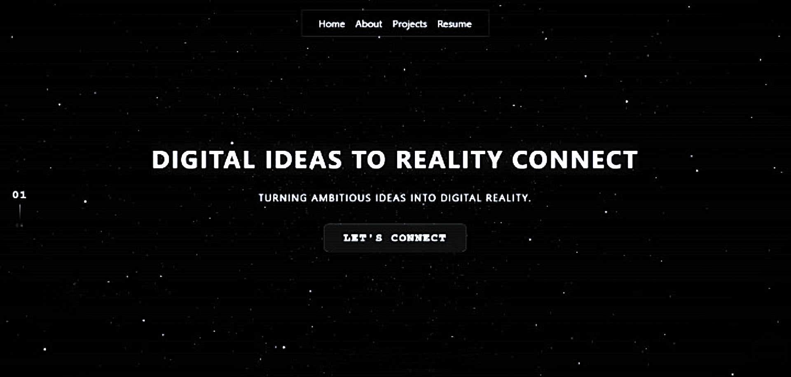

<div align="center">

#  Surya Website

[](https://surya.is-a.dev)
[](https://vitejs.dev/)
[-red?style=flat-square)](LICENSE)

*Welcome to my awesome website! This repository hosts the source code for my portfolio website hosted on GitHub Pages.*

<br>


</div>

---

##  Description

This website showcases my projects, social media links, and my skills. Feel free to contact me if you have any questions or feedback!

##  Building

This project is configured strictly for **production builds only** - there is no dev server, no preview, and no test mode (blocked natively). A custom Vite configuration aggressively bundles, minifies (using proprietary plugins for HTML, CSS verbatim mapping, and internal branding), and content-hashes the website source from `src/` into a highly-optimized `dist/` directory that GitHub Actions deploys to GitHub Pages.

### Prerequisites

- **Node.js** `20+`
- **npm** `10+`

### Commands

| Command | Description |
|:---|:---|
| `npm install` | **One-time** - installs Vite and the build dependencies |
| `npm run validate` | Validates the HTML structure |
| `npm run build` | Builds the site into `./dist` |
| `npm run clean` | Removes the `dist/` directory |

### Project layout

```text
.
├── src/                  ← website source (HTML, JS, CSS, assets)
├── scripts/              ← build tooling
├── static/               ← static files
├── dist/                 ← build output
├── vite.config.js        ← Vite build config
├── package.json          ← project metadata and scripts
├── README.md             ← this file
└── LICENSE               ← license terms
```

##  License

This project is licensed under a custom **All Rights Reserved License**.

> ⛔ **WARNING**  
> You may not copy, modify, redistribute, or use the code in any way without explicit written permission from the copyright holder!

See the [LICENSE](LICENSE) file for full terms and details.

